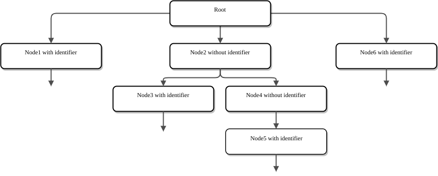
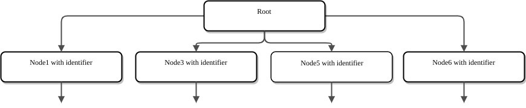

# Co-occurrence matrix calculation.
This document covers the algorithm to calculate identifiers co-occurrence matrix of identifiers based on UAST from [bblfsh](https://doc.bblf.sh/).
It's the step to calculate embeddings for them.

There are several files related to this process:
* ast2vec/repo2/cooccbase.py - base class with main logic for UAST traversing
* ast2vec/repo2/coocc.py - construct matrix from scratch
* ast2vec/repo2/voccoocc.py - construct matrix with provided vocabulary
* ast2vec/voccoocc.py - model for modelforge (way to save/load model)
* ast2vec/coocc.py - model for modelforge

## ast2vec/repo2/cooccbase.py
It contains the logic for UAST traversing.
The base algorithm to compute the co-occurrence matrix is based on [BFS](https://en.wikipedia.org/wiki/Breadth-first_search).
Our goal is create context for each identifier.

As we can see on the image above - we have some nodes without identifiers that we need to filter out for this task.
When we filter them, we get situation like this:

And then we connect root with children and all children at the same level.

That will give us the final co-occurrence matrix.

## ast2vec/repo2/voccoocc.py & ast2vec/repo2/coocc.py
The difference between these 2 implementations:
* voccoocc works with the provided vocabulary
* coocc computes the vocabulary online

Voccoocc computing is useful for distributed computations:
* extract the vocabulary for all dataset
* extract the co-occurrence matrix for each repository on the map stage
* sum all co-occurrence matrices on the reduce stage

In case of coocc - local usage with ast2vec pipeline:
* extract the vocabulary and compute the co-occurrence matrix for each repository independently
* use `python3 -m ast2vec id2vec_preproc` to prepare the input for [swivel](https://github.com/src-d/tensorflow-swivel)

## ast2vec/voccoocc.py & ast2vec/coocc.py
Helper classes to work with [modelforge](https://github.com/src-d/modelforge).